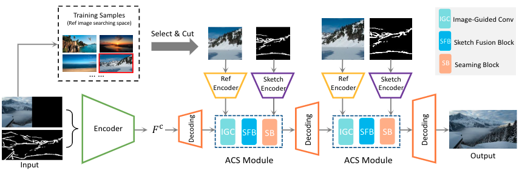
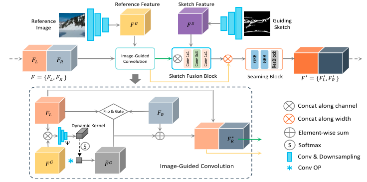
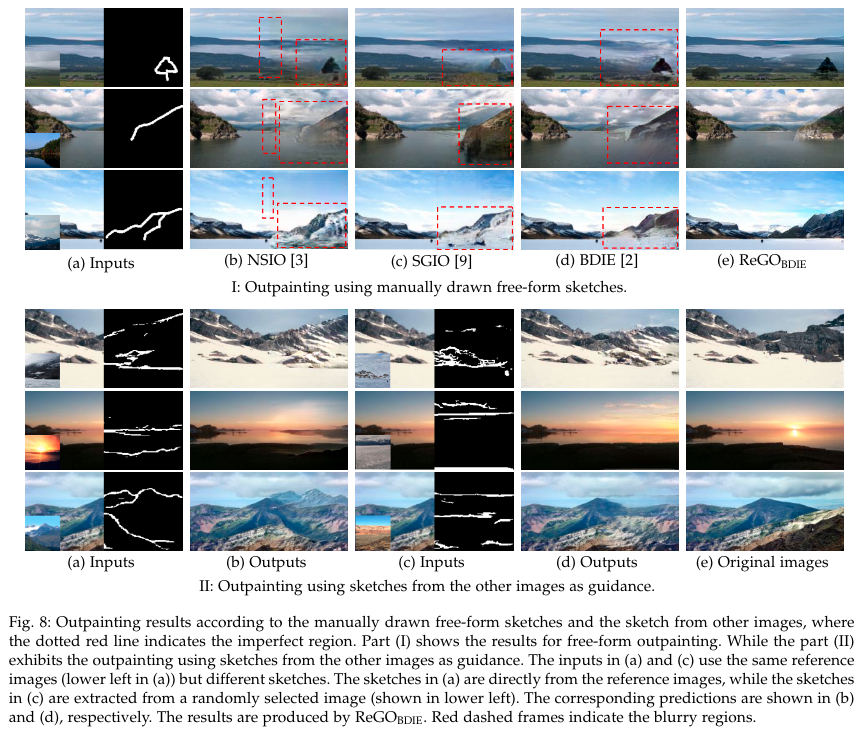

# ReGO: Reference-Guided Outpainting for Scenery Image 

pytorch implementation of ReGO: Reference-Guided Outpainting for Scenery Image.
Note: we only release the code of our Best model: BDIE with ReGO equipped i.e., ReGO<sub>BDIE.

The framework of our ReGO:



Our proposed Adaptive Content Selective Moduel(ACS):



Examplar outputs of our model:




## Requirements

```
pytorch
torchvision
torchsummary
numpy
Pillow
random
glob
```

## Prepare datasets
1. Download [NS6K and NS8K dataset](https://drive.google.com/file/d/1nM71LTeKfH5KjYoKJGscOcuMFHhJSwZT/view?usp=sharing) 
2. unzip the zip file to 'data' directory: ```unzip -d data NS6K+NS8K.zip```

## Train, run
```
CUDA_VISIBLE_DEVICES=GPU_ID python train.py --dataset_name ./data/NS6K_Train/ --batch_size BATCH_SIZE --n_epochs TRAIN_EPOCHES --gpu 0
```
or edit the train.sh file and run 'sh train.sh' 

## Test
```
#test and generate the images
CUDA_VISIBLE_DEVICES=GPU_ID python test.py --model MODEL_PATH --image-path ./data/NS6K_Test/ --output OUTPUT_DIR  --gpu 0 --use_gpu
```

```
#calculate FID
python fid.py GT_PATH OURPUR_DIR --gen_mode 'gen' --gpu GPU_ID
```

```
#calculate IS
CUDA_VISIBLE_DEVICES=GPU_ID python eval_fid_is_score.py --gen_image_path OUTPUT_DIR --use_gpus 0 --gen_mode 'gen' 
```
or edit the eval.sh and run ```sh eval.sh```

## Acknowledge
This project is built on the top of this code: [Boundless](https://github.com/recong/Boundless-in-Pytorch). Thanks the authors' contribution.
